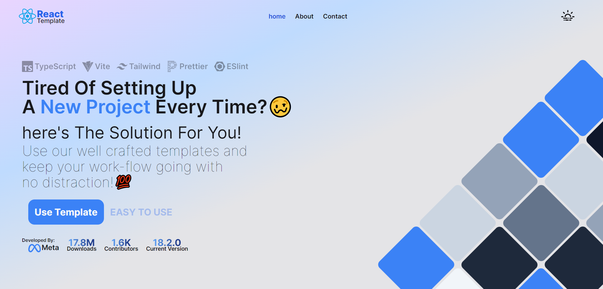
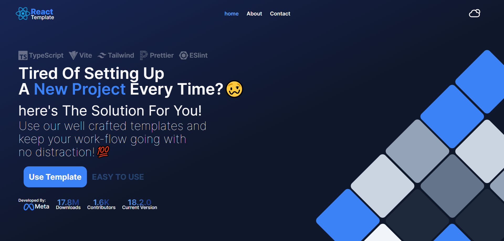

# React Template

Welcome to the React Template! This project is a robust and efficient starting point for building modern web applications using the latest technologies in the ecosystem. It is meticulously crafted with Vite, TypeScript, Tailwind CSS, ESLint, and Prettier to ensure a seamless development experience.

## Table of Contents

- [Features](#features)
- [Prerequisites](#prerequisites)
- [Getting Started](#getting-started)
- [Available Scripts](#available-scripts)
- [Customization](#customization)
- [Contributing](#contributing)
- [Screenshots](#screenshots)
- [License](#license)

## Features

- **Vite:** Ultra-fast development environment and build tool.
- **React:** A powerful library for building user interfaces.
- **TypeScript:** Strongly typed JavaScript for improved code quality.
- **Tailwind CSS:** A utility-first CSS framework for rapid UI development.
- **ESLint:** Identifies and reports on patterns found in ECMAScript/JavaScript code.
- **Prettier:** An opinionated code formatter to maintain code consistency.

## Prerequisites

Before you begin, ensure you have met the following requirements:

- Node.js (version 14 or above)
- npm or Yarn

## Getting Started

To get started with this template, follow these steps:

1. **Clone the repository:**

   ```bash
   git clone https://github.com/WolfieLeader/react-template.git
   ```

2. **Navigate to the project directory:**

   ```bash
   cd react-vite-template
   ```

3. **Install the dependencies:**

   ```bash
   npm install
   ```

4. **Start the development server:**

   ```bash
   npm run dev
   ```

This will launch the development server and automatically open the application in your default web browser.

## Available Scripts

In the project directory, you can run the following scripts:

- **`npm run dev`**: Starts the development server.
- **`npm run build`**: Builds the application for production.
- **`npm run lint`**: Runs ESLint to analyze code for potential errors.

## Customization

You can customize the template to suit your needs. Here are some key points for customization:

- **Tailwind CSS:** Modify the `tailwind.config.cjs` file to adjust the default theme, extend utility classes, and more.
- **ESLint:** Update the `.eslintrc.cjs` file to change linting rules according to your coding standards.
- **Prettier:** Adjust the `.prettierrc.json` file to configure code formatting preferences.

## Contributing

Contributions are what make the open-source community such an amazing place to learn, inspire, and create. Any contributions you make are **greatly appreciated**.

1. Fork the Project
2. Create your Feature Branch (`git checkout -b feature/AmazingFeature`)
3. Commit your Changes (`git commit -m 'Add some AmazingFeature'`)
4. Push to the Branch (`git push origin feature/AmazingFeature`)
5. Open a Pull Request

## Screenshots

Light mode:


Dark mode:


## License

This project is licensed under the MIT License. See the [LICENSE](LICENSE) file for more details.

---

Thank you for using the React Vite Template! We hope this template serves as a solid foundation for your projects and accelerates your development workflow.
